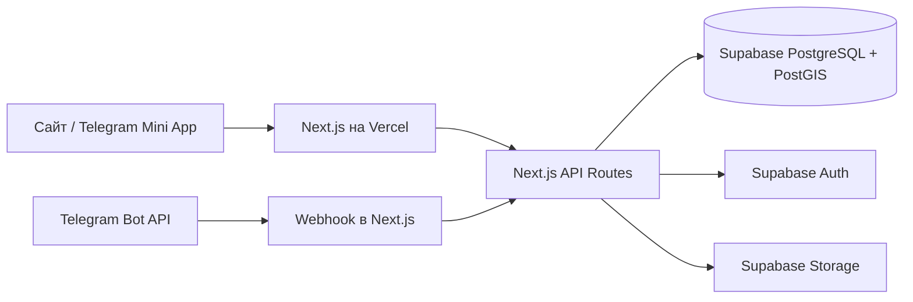

# HOOPMAP

Карта баскетбольных площадок, открытые игры и Telegram Mini App. Основной deployment полностью
serverless и помещается в бесплатные тарифы Vercel Hobby и Supabase Free для личного MVP.

## Текущая архитектура



Отдельный backend-хост, Redis, Celery и Docker для deployment не нужны. Каталоги `backend/`,
`bot/`, Compose и Nginx сохранены как legacy-реализация на время перехода, но Vercel их не
собирает и не запускает.

## Возможности

- MapLibre-карта с загрузкой площадок по текущему `bbox`;
- геопоиск PostGIS и сортировка по расстоянию;
- добавление площадок и фотографий с модерацией;
- безопасная проверка Telegram `initData`;
- Supabase Auth sessions: access token в памяти, refresh token в `HttpOnly` cookie;
- RLS-права для пользователей, модераторов и администраторов;
- избранное, подтверждения актуальности и открытые игры;
- атомарное присоединение к игре с контролем количества мест;
- Telegram webhook с картой, играми и поиском по геолокации;
- database-backed rate limits для чувствительных операций;
- CSP, HSTS и защитные HTTP-заголовки.

## Структура активной версии

```text
basketball-courts/
├── frontend/
│   ├── src/app/api/v1/            API площадок, игр и авторизации
│   ├── src/app/api/telegram/       Telegram webhook
│   ├── src/lib/supabase/           Auth, clients и сериализация
│   └── .env.vercel.example
├── supabase/
│   ├── bootstrap.sql               схема, PostGIS, RLS и функции
│   ├── seed.sql                    необязательные демо-площадки
│   └── README.md                   пошаговый deployment
├── backend/                        legacy Django
└── bot/                            legacy aiogram polling bot
```

## Локальный запуск без Docker

1. Выполните `supabase/bootstrap.sql` в своём Supabase-проекте.
2. Скопируйте переменные:

   ```bash
   cp frontend/.env.vercel.example frontend/.env.local
   ```

3. Заполните Supabase и Telegram значения.
4. Запустите:

   ```bash
   cd frontend
   npm ci
   npm run dev
   ```

Сайт будет доступен на <http://localhost:3000>. Для публичного просмотра карты Telegram token не
нужен; он требуется для входа и webhook.

## Deployment

Полный пошаговый процесс находится в [`supabase/README.md`](supabase/README.md). Коротко:

1. выполнить `supabase/bootstrap.sql`;
2. при необходимости выполнить `supabase/seed.sql`;
3. импортировать репозиторий в Vercel с **Root Directory = `frontend`**;
4. добавить переменные из `frontend/.env.vercel.example`;
5. выполнить deployment;
6. зарегистрировать Telegram webhook.

## API

Клиентский контракт сохранён с префиксом `/api/v1`:

```text
POST   /auth/telegram/
POST   /auth/refresh/
POST   /auth/logout/
GET    /auth/me/

GET    /courts/
POST   /courts/
GET    /courts/{id-or-slug}/
GET    /courts/nearby/
POST   /courts/{id}/photos/
POST   /courts/{id}/verify/
POST   /courts/{id}/favorite/
DELETE /courts/{id}/favorite/
POST   /courts/{id}/moderate/

GET    /games/
POST   /games/
GET    /games/{id}/
POST   /games/{id}/join/
POST   /games/{id}/leave/
```

Загрузка фотографий идёт напрямую browser → Supabase Storage по одноразовой подписанной ссылке,
поэтому не упирается в лимит размера тела Vercel Functions.

## Проверки

```bash
cd frontend
npm run typecheck
npm run lint
npm test
npm run build
```

Vercel Hobby предназначен для личных некоммерческих проектов. Для коммерческого запуска или
гарантированного SLA понадобится платный тариф, но архитектуру переписывать повторно не потребуется.
