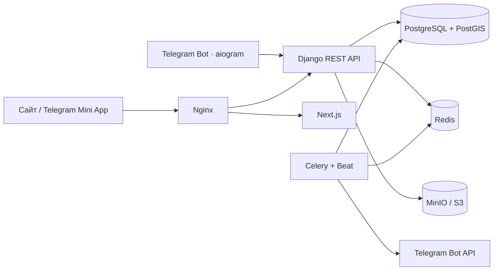

# HOOPMAP

Production-oriented MVP веб-сервиса, Telegram Mini App и бота для поиска баскетбольных площадок и организации открытых игр. Первый набор тестовых данных относится к Тольятти, но город и страна являются обычными полями, а геопоиск не ограничен конкретной территорией.

## Возможности

- карта MapLibre с кластеризацией и загрузкой по текущему `bbox`;
- поиск площадок рядом средствами PostGIS и сортировка по расстоянию;
- фильтры по городу, покрытию, состоянию, доступу, свету, сеткам и кольцам;
- добавление площадки с фото, проверкой дубликатов в радиусе 50 м и модерацией;
- безопасная Telegram Web App authentication с серверной проверкой подписи `initData`;
- JWT access/refresh tokens, роли и object-level permissions;
- отзывы, жалобы, подтверждения актуальности и избранное;
- создание игр, присоединение, выход и контроль количества мест в транзакции;
- Telegram-бот с поиском по присланной геолокации и переходами в Mini App;
- S3-совместимое хранение, локально — MinIO; оригиналы очищаются от EXIF, создаётся thumbnail;
- Django Admin с картой, фото, жалобами, дубликатами и массовой модерацией;
- Swagger, ReDoc, seed-данные, тесты и CI.

## Архитектура



Бот никогда не обращается к PostgreSQL: пользовательские данные, площадки и игры он получает только через REST API. Доменная логика backend вынесена из view/serializer в `services.py`, геозапросы и агрегаты — в `selectors.py`.

## Структура

```text
basketball-courts/
├── backend/                 Django, DRF, GeoDjango, Celery
│   ├── apps/accounts/       пользователи, Telegram auth, JWT
│   ├── apps/courts/         площадки, фото, отзывы, модерация
│   ├── apps/games/          игры и участники
│   └── tests/
├── frontend/                Next.js App Router + Mini App
├── bot/                     aiogram 3, только REST API
├── nginx/
├── docker-compose.yml
├── docker-compose.prod.yml
├── .env.example
└── Makefile
```

## Требования

- Docker Engine 25+ и Docker Compose v2;
- Telegram-бот от [@BotFather](https://t.me/BotFather) для Telegram-интеграции;
- HTTPS-домен для запуска Mini App вне локальной разработки.

Локально устанавливать Python, PostgreSQL, Node.js и GDAL не нужно — они находятся в контейнерах. Backend image использует Python 3.13, база — PostgreSQL 17 с PostGIS.

## Быстрый запуск

```bash
cp .env.example .env
# заполните DJANGO_SECRET_KEY, INTERNAL_API_TOKEN и при необходимости TELEGRAM_BOT_TOKEN
make up
make seed
```

После запуска:

- сайт: <http://localhost/>;
- Django Admin: <http://localhost/admin/>;
- Swagger: <http://localhost/api/docs/>;
- ReDoc: <http://localhost/api/redoc/>;
- OpenAPI schema: <http://localhost/api/schema/>;
- MinIO Console: <http://localhost:9001/>.

Seed-команда создаёт администратора `admin`, модератора, пользователей, 24 площадки с изображениями, отзывы, жалобы, подтверждения и игры. Пароль development-администратора задаётся `SEED_ADMIN_PASSWORD`.

## Переменные окружения

Скопируйте `.env.example`; реальные секреты не должны попадать в git.

| Переменная | Назначение |
|---|---|
| `DJANGO_SECRET_KEY` | ключ подписи Django/JWT |
| `DJANGO_DEBUG` | `false` в production |
| `DATABASE_URL` / `POSTGRES_*` | подключение PostgreSQL/PostGIS; URL имеет приоритет |
| `DB_POOL_MODE` | `session`, `transaction` или `direct` |
| `DB_SEARCH_PATH` | private schema и схемы расширений PostgreSQL |
| `REDIS_URL` | Celery, результаты задач и throttling cache |
| `TELEGRAM_BOT_TOKEN` | токен BotFather; также участвует в проверке `initData` |
| `TELEGRAM_WEBAPP_URL` | публичный HTTPS URL Mini App |
| `INTERNAL_API_TOKEN` | отдельный длинный секрет bot → backend |
| `S3_*` | endpoint, bucket, credentials и публичный домен S3 |
| `NEXT_PUBLIC_API_URL` | URL API, видимый браузеру |
| `NEXT_PUBLIC_MAP_STYLE_URL` | URL стиля MapLibre |

Для production сгенерируйте разные случайные значения минимум по 32 байта для `DJANGO_SECRET_KEY`, `INTERNAL_API_TOKEN`, паролей PostgreSQL и MinIO. Ограничьте `DJANGO_ALLOWED_HOSTS`, `DJANGO_CSRF_TRUSTED_ORIGINS` и `CORS_ALLOWED_ORIGINS` реальным доменом.

## Команды

```text
make up              собрать и запустить сервисы
make down            остановить сервисы
make build           собрать images
make migrate         применить миграции
make makemigrations  создать миграции
make superuser       создать администратора
make seed            загрузить демонстрационные данные
make test            backend и frontend unit tests
make lint            Ruff и TypeScript
make format          форматирование Python и frontend
make logs            логи всех сервисов
```

## API

Все прикладные endpoint имеют префикс `/api/v1/`.

```text
POST   /auth/telegram/                 проверка initData, выдача JWT
POST   /auth/refresh/                  обновление access token
GET    /auth/me/                       текущий пользователь

GET    /courts/?bbox=minLon,minLat,maxLon,maxLat
POST   /courts/
GET    /courts/{id}/
PATCH  /courts/{id}/
DELETE /courts/{id}/
GET    /courts/nearby/?lat=&lon=&radius=
GET    /courts/{id}/duplicates/
POST   /courts/{id}/photos/
POST   /courts/{id}/reviews/
POST   /courts/{id}/reports/
POST   /courts/{id}/verify/
POST   /courts/{id}/favorite/
DELETE /courts/{id}/favorite/

GET    /games/
POST   /games/
GET    /games/{id}/
PATCH  /games/{id}/
DELETE /games/{id}/
POST   /games/{id}/join/
POST   /games/{id}/leave/
```

Пагинация стандартно возвращает `count`, `next`, `previous`, `results`; `page_size` ограничен 100. Ошибки имеют единый envelope `{"error":{"code":400,"details":...}}`. Полные параметры, request/response schemas и коды ответов доступны в Swagger.

## Авторизация и permissions

Telegram Mini App отправляет backend исходную строку `initData`. Backend:

1. извлекает `hash`;
2. строит `data_check_string` из отсортированных полей;
3. получает секрет через HMAC-SHA256 с ключом `WebAppData` и bot token;
4. сравнивает подписи constant-time операцией;
5. проверяет `auth_date` и только затем создаёт/обновляет пользователя.

`initDataUnsafe` не используется как доверенный источник. Короткоживущий access JWT хранится
только в памяти вкладки. Refresh token доступен лишь backend: он находится в `HttpOnly`, `Secure`,
ограниченной по пути cookie, ротируется при каждом обновлении, а старое значение попадает в
blacklist. Cookie-endpoint дополнительно проверяет браузерный `Origin`.

Роли:

- `user` — читает опубликованные площадки, добавляет свои на модерацию, загружает фото, подтверждает, жалуется, создаёт игры;
- `moderator` — видит очередь, фото, жалобы и дубликаты, меняет статусы;
- `admin` — права модератора плюс управление пользователями и системной конфигурацией.

Обычный пользователь не может записать `status`, `source`, `source_id`, `verified_at` или опубликовать площадку. Редактирование собственной площадки разрешено только до публикации.

## Модерация

Новая площадка всегда сохраняется как `pending`. Пользователь видит возможные дубликаты в 50 м перед отправкой; тот же PostGIS-запрос доступен модератору. В Admin есть карта координат, preview фото, фильтры, открытые жалобы и массовые действия «опубликовать/отклонить». Административные действия логируются, результат модерации отправляется пользователю Celery-задачей в Telegram.

## Telegram-бот и Mini App

1. Создайте бота у BotFather и заполните `TELEGRAM_BOT_TOKEN`.
2. Укажите публичный HTTPS URL в `TELEGRAM_WEBAPP_URL`.
3. В BotFather настройте Menu Button/Web App на тот же URL.
4. Запустите `bot` вместе с Compose. MVP использует long polling, поэтому webhook не требуется.

Команды: `/start`, `/map`, `/nearby`, `/add`, `/games`, `/profile`. Для `/nearby` бот запрашивает нативную геолокацию, вызывает PostGIS endpoint и показывает до пяти площадок с маршрутом и кнопкой Mini App.

Frontend автоматически обнаруживает Telegram Web App, вызывает `ready()`/`expand()`, учитывает safe area и тему, затем обменивает проверенный `initData` на JWT.

## S3 вместо MinIO

Бизнес-логика использует стандартный Django Storage API. Для внешнего S3 измените только `S3_ENDPOINT_URL`, credentials, bucket, region, SSL и `S3_CUSTOM_DOMAIN`; код моделей и upload-сервис менять не нужно. Bucket должен существовать и разрешать чтение опубликованных файлов. В production рекомендуется CDN перед S3.

## Supabase + Vercel

Для Supabase подготовлены отдельный безопасный шаблон переменных, SQL bootstrap приватной схемы с PostGIS и диагностическая команда. Полная пошаговая инструкция находится в [`supabase/README.md`](supabase/README.md).

```bash
cp .env.supabase.example .env.supabase
# выполнить supabase/bootstrap.sql в Supabase SQL Editor
python manage.py migrate
python manage.py check_supabase --storage
```

Frontend размещается на Vercel с корнем проекта `frontend`; пример публичных переменных находится в `frontend/.env.vercel.example`. Django API, Celery, Beat и Telegram-бот остаются отдельными long-running сервисами.

Для production предпочтительны собственные поддомены одного сайта, например `app.example.com` и
`api.example.com`: тогда refresh-cookie может использовать `SameSite=Lax`. Если frontend остаётся
на `*.vercel.app`, а API находится на другом сайте, установите `AUTH_COOKIE_SAMESITE=None`,
`AUTH_COOKIE_SECURE=true`, оставьте `AUTH_COOKIE_DOMAIN` пустым и внесите точный Vercel origin в
`CORS_ALLOWED_ORIGINS`. Не используйте wildcard для production-origin.

## Тесты и качество

Backend использует pytest, pytest-django и factory_boy. Тестируются Telegram-подпись, создание и permissions площадок, `bbox`, nearby, дубликаты, избранное, cooldown подтверждений, rate limit, создание игр, join/leave и вместимость. Для GIS-тестов нужен PostGIS — он поднимается в GitHub Actions.

Frontend использует Vitest + Testing Library и Playwright с desktop/mobile профилями. CI запускает Ruff, mypy, проверку миграций, backend tests, ESLint, TypeScript strict, unit tests и production build.

```bash
# отдельно backend внутри контейнера
docker compose run --rm backend pytest
docker compose run --rm backend ruff check .

# отдельно frontend
docker compose run --rm frontend npm run typecheck
docker compose run --rm frontend npm test
docker compose run --rm frontend npm run test:e2e
```

## Production

Используйте оба compose-файла:

```bash
docker compose -f docker-compose.yml -f docker-compose.prod.yml up -d --build
```

Перед публичным запуском добавьте TLS termination, резервное копирование PostgreSQL и bucket, мониторинг Celery/HTTP, централизованные логи и собственный production MapLibre style/tiles endpoint. `docker-compose.prod.yml` закрывает порты данных и включает `DJANGO_DEBUG=false`; секреты целесообразно передавать через secret manager платформы.

Полный security-чеклист и правила ротации ключей находятся в [`SECURITY.md`](SECURITY.md).
